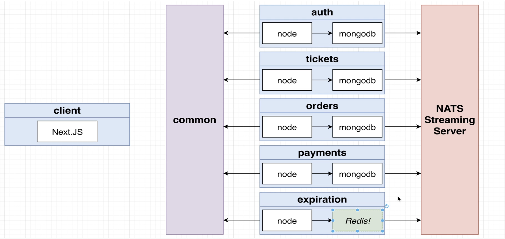
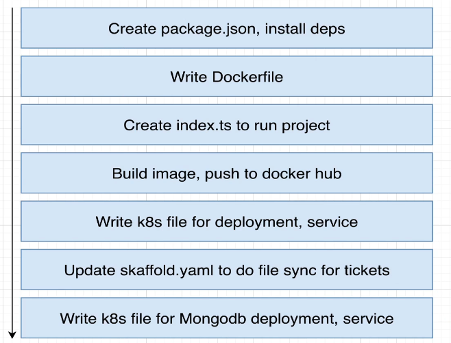
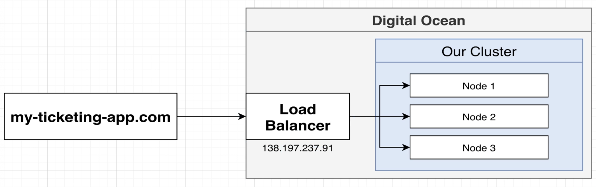
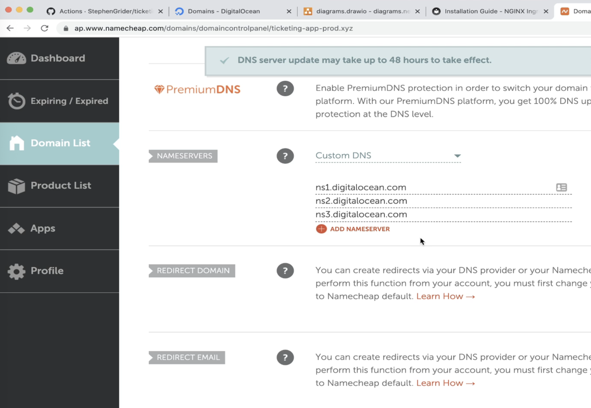

<h1><b style="font-size: 4rem; letter-spacing: 0.2rem; color: #5D759E">Ticketing Management time!</b></h1>

## Description

This project is meant to demostrate how a simple application such as this one can be modularized / devided into separted microservices, and how to solve data sharing between all of them.
We're relying on the promise of async commmunication between all of these microservices to ensure
independece between them. This way, we can trust our app to be functional even when one or more of these services go down.
By taking this async approach of course we'll have to handle data between services in a more complex and efficient way.

For this specific version we'll be using Kubernetes to create each cluster and manage pods, deployments, services, etc .. and pointing at docker engine on local. This orquestration could also be approached as an alternative for lower performance hardware users by building all of these clusters on some cloud provider.
Also, we won't deploy this app into any cloud provider cluster or build any cloud infrastructure, but instead mention everything that would be needed if we wanted to deploy it. See 'Deployment Options' section.

## Schemas



## Local dev setup

## Infra

### Ingress

Ingress paths will always check for matching incomming requests with paths defined on vertical order from up to down. Said this, we need to make sure that all specificp paths are listed first, and let the more general paths into the end. For example, `/?(.*)` which is for ALL paths (used on Client app) should be listed at the button, below specific paths for example used by the Auth app such as `/api/users/?(.*)`

## Skaffold:

## Common steps for each service creation:

1. Create folder + `.gitignore` + `README.md` + `tsconfig.json` + `.dockerignore` + `Dockerfile` + `package.json` + create /src folder with `index.ts` file. This step can be also achieved by copying those files from any other service like `tickets` and modifying some basic service naming values and imports.
2. Modify `skaffold.yaml` to sync changes made on new service folder.
3. Install dependencies used at `package.json` by running `npm install`. If any other specific dependency is needed install it by using same command + the name of the dependency and also its types definition (e.g `npm install bull @types/bull`). Please double check for the correct types dependency naming at https://www.npmjs.com/
4. Create the docker image by running `docker build -t <YOUR_DOCKER_USER>/<SERVICE_NAME> .`
5. Push your docker image into docker hub by running `docker push <YOUR_DOCKER_USER>/<SERVICE_NAME>`
   Setup command on ingress-nginx:
   Needed for executing that command manually against the D.O cluster or any other provider.
   More information at: https://kubernetes.github.io/ingress-nginx/deploy/
   Copy the needed command and run it inside a terminal ONLY if our kubectl client is connected to the cloud provider cluster (check context).6. Create k8s deployment file/s at `infra` dir (e.g `<SERVICE_NAME>-depl.yaml`). Follow other's services files structure as a guide for the new one. Take into account what this new service needs to run properly in coordination with other services (Cluster IP, Ingress configuration, Mongoose deployment, etc).



## Deployment Options

Our app is currently designed to run on local virtual machines managed by k8s, but if we wanted to upload it to a third-party cloud service there would be a couple of things to consider:

Start on DigitalOcean if you’re a cloud beginner since this provider is one of the easiest to setup. Go for AWS/GCP instead if you’re advanced and have a bigger budget.

### For DigitalOcean:

#### Cluster creation:

Create a cluster by selecting a k8s version. Default is OK. Select the region as physically close to us as possible. VPC network is OK by default. Cluster capacity should be set to standard nodes with at least 3 nodes (2 is possible but harder to run the whole app). Set a name for the cluster like ‘ticketing_management’. Once created, it could take a couple of minutes for the cluster to get created.

#### Connect to cluster from localhost (For logs, not related to uploads):

We’re currently using kubectl with some context config for it to know how to connect to our local cluster. For connecting into the DigitalOcean cluster, we’ll have to create a second context config by using the command-line tool for giving the instructions.

1. On the DigitalOcean cluster main page —> Install Management tools —> install doctl OR download it at https://github.com/digitalocean/doctl following README instructions
2. Go to D.O API’s page and generate a new token for using the CLI
3. Run on terminal the following command ..

```bash
doctl auth init
```

.. then paste the token when prompted.

4. Install context to add credentials:

```bash
doctl kubernetes cluster kubeconfig save <cluster_name>
```

5. After the last step, any command run on our terminal using kubectl should impact our D.O cluster instead of our local one (k get pods, etc)
6. Since we could potentially need to go back to our local context for modifications, we can list all config files by running:

```bash
kubectl config view
```

...and then change to our local context (name: docker-desktop) by running:

```bash
kubectl config use-context docker-desktop
```

#### Connect to cluster from GitHub (DEPLOYMENT PLAN):

We’ll need one new workflow file per service to allow GitHub Actions to update deployments into the D.O cluster. There will also be an extra workflow for ‘infra’ config files to ALWAYS run. This is so that each time there’s a new PR merged into our main branch, a new image will be built and finally uploaded.

#### Steps for each service:

Service > Build new image > Push to Docker Hub > Update Deployment (D.O versions management)

We can see as example the `deploy-auth.yaml` file at https://github.com/hanoirocker/ticketing_management/blob/main/assets/github-workflows/deploy-auth.yaml running on pushes into the main branch (commits or PRs merged into main). The `run` command will include changing into the service, creating a new Docker image and pushing it into Docker Hub.
To tell our D.O cluster to use the latest Docker image built by GitHub, we’ll basically do what we did in the previous step on our local machine but in the GitHub container instead (install `doctl`, create config for connecting to the D.O cluster, connect using `kubectl`).
So to install `doctl` inside the container and authorize it using the API key, get credentials to save the context configs and restart our latest built image on our D.O cluster, we’ll add some extra lines.

<b>EXAMPLE</b>

```bash
- uses: digitalocean/action-doctl@v2
  with:
    token: ${{ secrets.DIGITALOCEAN_ACCESS_TOKEN }}
- run: doctl kubernetes cluster kubeconfig save <name_of_digital_ocean_cluster>
- run: kubectl rollout restart deployment auth-depl
```

In order to use the `DIGITALOCEAN_ACCESS_TOKEN` we need to have previously created it under the repository secrets using a new generated API token at DigitalOcean (e.g., called `github_access_token`)

EXAMPLE:
https://github.com/hanoirocker/ticketing_management/blob/main/assets/github-workflows/deploy-auth.yaml

For infra’s deployment files we’ll create the deploy-manifests.yaml file with the following config:

https://github.com/hanoirocker/ticketing_management/blob/main/assets/github-workflows/deploy-manifests.yaml

As seen on last manifests file we don’t need to build and push any Docker image in that workflow or do any rollout, but only get the doctl context and apply those config files from our k8s directory into our D.O cluster.

<b>IMPORTANT NOTE</b>
All deployment manifest for our services will be created and store under ./assets/github-workflows/ directory as an example of what these deployment workflows should look like. Those should be placed at ./.github/workflows instead once Digital Ocean's cluster is finally setup as well as all needed secrets such as the ones for Docker logging in and our cluster's access token. Remeber that these tokens has to be created under our repository, not inside of our cloud provider cluster.
To create repository secret keys, go to `Settings —> Secrets and Variables —> Actions` and create secrets for:

- DOCKER_USER
- DOCKER_PASSWORD
- DIGITALOCEAN_ACCESS_TOKEN

To use those secrets inside our YAML script, we’ll use a new run command:

```bash
docker login -u $DOCKER_USER -p $DOCKER_PASSWORD
```

...and also add an env config to expose those repository secrets as variables to use in our workflow.

#### Resolve ingress-srv ‘host’ value:

The actual `host: ticketing.dev` hostname works for the local environment but it should be different depending on the working environment.
To solve that, we’ll create a couple of new directories under `infra/k8s-dev` and `infra/k8s-prod` to split manifests (.yaml files) between those directories. This will allow us to apply those config files to specific environment clusters (local cluster, dev cluster, and prod cluster).
Finally, we'll change the `skaffold.yaml` to grab configs from manifests under the `k8s-dev` directory and add a command for the `deploy-manifests.yaml` workflow to apply configs from the `k8s-prod` folder.

#### Create needed APP secrets (JWT, STRIPE, etc):

Since we’re using a couple of secret keys inside of our manifests created previously with kubectl to reside under our local cluster, we’ll have to define those again with `kubectl` to reside in our cloud provider cluster instead.

```bash
kubectl config use-context <cloud_cluster_context_name>
```

If we don’t remember the context name we can always list available contexts by running ...

```bash
kubectl config view
```

...to grab the needed context name.
After setting up the correct context for running commands pointing at the cloud cluster, create the secrets by doing:

```bash
kubectl create secret generic <new_name_of_secret> --from-literal=<name_of_secret>=<key_value>
```

<b>EXAMPLES</b>

```bash
kubectl create secret generic jwt_secret --from-literal=JWT_KEY=<key_value>
kubectl create secret generic stripe_secret --from-literal=STRIPE_KEY=<key_value>
```

Perform this last step for all secrets to be used inside the cluster.

#### Setup command on ingress-nginx:

Needed for executing that command manually against the D.O cluster or any other provider.
More information at: https://kubernetes.github.io/ingress-nginx/deploy/
Copy the needed command and run it inside a terminal ONLY if our kubectl client is connected to the cloud provider cluster (check context).

So far, if everthing is correctly setup and if we upload new changes into our services repository coe we should be able to:

- Verify that related test workflows run after a new pull request is created
- After the PR is merged, deployment workflows runs and successfully creates the new images, push them into docker hub and finally update our cluster images with these last created.
- If we try to access our Load Balancer's external ip address using our browser we should see a `404 Not Found` error pointing at nginx.

#### Buying a domain name and understanding some Load Balancing basics:



<b>NOTE</b>
Load Balancers are automatically setup by Digital Ocean, but that wouldn't be always the case if we decided to go other cloud proviers

Load balancers are meant to redirect incomming traffic into our clusters. Also, these balancers have an external ip addressed assigned by the cloud provider.
In order to access our client app from our browser we need to connect to this external ip address, having two possible ways for this:

- Connect using the numeric ip address (e.g `138.197.237.91`).
- Connect using a `Domain name` previously reserved. This is basically a mask for the Load Balancer's external ip address. Check for example https://www.namecheap.com/. Steps for this alternative:

  1. Enter a new domain name (the longer the domain name is, the cheaper). Results will should a list of similar and available domain names to buy. Select the one you want and buy it.
  2. Point the bought domain name at our load balancer by changing its `DNS Servers` or `NAMESERVERS` property. By default when a domain is bought this parameter will be set to a default value, so we need to change it into custom ones. These custom ones are new string values to use on our cloud provider Networking options.

  <b>EXAMPLE/b>
  

  3. Go back to your cloud provider and go to Networking options to add a domain.
  4. Add the recently bought domain name.
  5. Once added, we'll be prompted to stablish a couple of settings to define how this domain name behaves. Basically we need to create two config records, one of type 'A' and another of type 'CNAME'

  - Type 'A': Enter `@` as `hostname`. Select our load balancer on redirection options (`Will Directo to` for D.O). Set time to life `TTL` to `30`. Create the record.
  - Type 'CNAME': Enter `www` as `hostname`. On alias input use `@` and set time to life `TTL` to `30`. Create the record.

#### Fix ingress-nginx host name:

Go to `k8s-prod/ingress-srv.yaml` file and set our `www.<domain_name>` into rules[host].

<b>After all of this is done, it could take up to 30 mins for our domain setup to be ready for accepting incomming browser requests.</b>

## TODO's:

- Add in HTTPS (MOST IMPORTANT TOPIC): see https://cert-manager.io
- Add in Email Support: after a user buys a ticket it could be a good idea to give some feedback on the action via email along with some details. See `Mailchimp`, `Sendgrid` or similar third party email providers.
- Add in 'build' steps for our prod cluster: At the moment we're running our services and our client in 'dev' mode. If we take a look into our Dockerfiles we'll see that we are running `CMD ["npm", "start"]` for our backend services and that `start` command is define at our `package.json` file as e.g `"start": "ts-node-dev src/index.ts",` (ts-node-dev for dev mode).
  So, if we wanted to speed up our services for our prod cluster we could create new Dockerfiles for each service to run a different command (generally `node index.js`)
- Create a staging cluster: Ideal for deploying images and checking changes before merging them into our main branch. This would/could involve creating new deployment workflows that would run whenever a PR is created or updated (similar to test workflows). These manifests would be very similar to our actual deployment manifests but would instead push the new Docker images into our staging cluster. Also, once a PR is merged, we would need to make sure to delete all data from our staging cluster.
