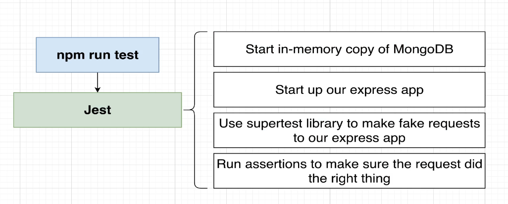

# Auth

Made for validating all user's actions on the ticketing macro project.
Also, this service will handle errors produced during this requests with an error Handler defined inside of this project so the client receives a detailed and properly structured error message.

## Routes:


## Errors structure:

This structure is defined as an object that wrapps the 'errors' list. This last is a list of different objects and for each one of them we define a message and a field that relates the message with the property that was validated.


## Auth MongoDB:

Using Mongoose to create database entries into our MongoDB instance running inside of our k8s cluster.
For more information on MongoDB instance: `<ticketing_infra_auth_mongo_depl_yaml_url>`


We'll create a `Mongoose User Model` (which will represent the entire colleciton of users) for running queries from our Auth pod straight into our MongoDB pod to be able to verify different case scnearios:


Also, we will define a `Mongoose User Document` that'll represent one single user inside of the User Collection structure.

Note: TypeScript and Mongoose are not best friends. There'll be two main problems to address on this:

- Define types for creating a new user such as email and password, to prevent typos which TS by default won't prevent us from.
- After creating a new user there will be a lot more properties out of our new user instance, so we'll limit them.


We'll be hashing our creation passwords and storing them into our cluster MongoDB for comparing them.

## Authentication approach:

We'll be approaching Async communication between services to ensure all of them operate independently. However, we won't be implementing the mechanisms required for optimal handling of token expiration, which is a downside of this approach.

Since we are building a server-side rendering React app with Next.js, we need to send authentication data (JWT) in a cookie along with the first browser request to the client. This ensures the client can pass the JWT to other services, such as the 'Order service,' for user validation. Server-side rendering limits the ability to customize initial requests using JavaScript, making this approach necessary.

- 'cookie-session': library to use for previous challenge. Makes it possible to handle cookies WITHOUT having any backing data store within our services. Also supports encryption, but we won't be using it. This is because it makes it easier for other services, possibly built in other languages, to read it. Additionally, we are not storing sensitive data inside our persistent JWTs.
- 'jsonwebtoken': for creating and verifying JWT's. Signing key must be stored securely to be able for sharing it across other services without revealing it. Will do it the Kubernetes way using the Secret object.

## Secrets:

- k8s Secrets: The Secret object will live inside of our k8s node and all secrets declared inside of it will be exposed as env variables for storing them directly into our services containers (not on each pod).

To create this secrets we first need to run out of the config files:

```bash
kubectl create secret generic jwt-secret --from-literal=JWT_KEY=asdf
```

This previous step is only for dev demostrations. If some really important secret key was meant to be declared, we should approach this in a more declarative way and call this command from a secure file for example.

## Testing:

- Testing arch:



The idea is to split the original index.ts into an app.ts file that can be export for being used inside of index.js. This way, we can later on manage tests on different ports (rather than trying to use the already running 3000 port) with supertest library.

We won't be runing any of the following dependencies at our docker image level. For this, we'll use flag `--omit=dev` inside of our Dockerfile.

```
npm install --save-dev @types/jest @types/supertest jest ts-jest supertest mongodb-memory-server
```

- mongodb-memory-server: (largest library). Makes it possible to run a copy of mongo-db for testing multiple data bases at the same time. This way, we don't have to try to connect to already running databases since we can have a specific copy running in memory for testing.
