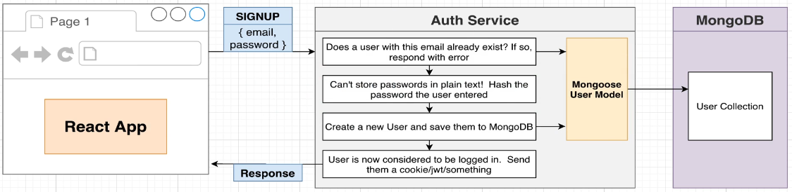

# Auth

Made for validating all user's actions on the ticketing macro project.
Also, this service will handle errors produced during this requests with an error Handler defined inside of this project so the client receives a detailed and properly structured error message.

## Routes:

## Errors structure:

This structure is defined as an object that wrapps the 'errors' list. This last is a list of different objects and for each one of them we define a message and a field that relates the message with the property that was validated.

## Auth MongoDB:

Using Mongoose to create database entries into our MongoDB instance running inside of our k8s cluster.
For more information on MongoDB instance: `<ticketing_infra_auth_mongo_depl_yaml_url>`

We'll create a `Mongoose User Model` (which will represent the entire colleciton of users) for running queries from our Auth pod straight into our MongoDB pod to be able to verify different case scnearios:

Also, we will define a `Mongoose User Document` that'll represent one single user inside of the User Collection structure.

Note: TypeScript and Mongoose are not best friends. There'll be two main problems to address on this:

- Define types for creating a new user such as email and password, to prevent typos which TS by default won't prevent us from.
- After creating a new user there will be a lot more properties out of our new user instance, so we'll limit them.

We'll be hashing our creation passwords and storing them into our cluster MongoDB for comparing them.

## Authentication approach:

There are basically two ways of handling user authentication when it comes to verifying their logged in status:

- Sync way: Client asks the Auth service if the user is active and if so, the request to any other service such as 'Orders' can be processed. Even though this is a safe way to handle this since we can also include token status logic, we'd be fully relying on the Auth service to processed any request so if by some case Auth goes down, no request can be processed.
- Async way: Give some basic logic to our services to determine if a user is banned or not. This makes all services independent from Auth, but extra logic should be involve token validation. For example, if a user gets banned at a certain moment of time there would be possibly an active token for this user and therefore, no request restrictions would be applied.

We'll be approaching the Async way to rely on independece of services concept, but won't be building what would be needed for best handling token expiration verification to address this approach's downsides.
