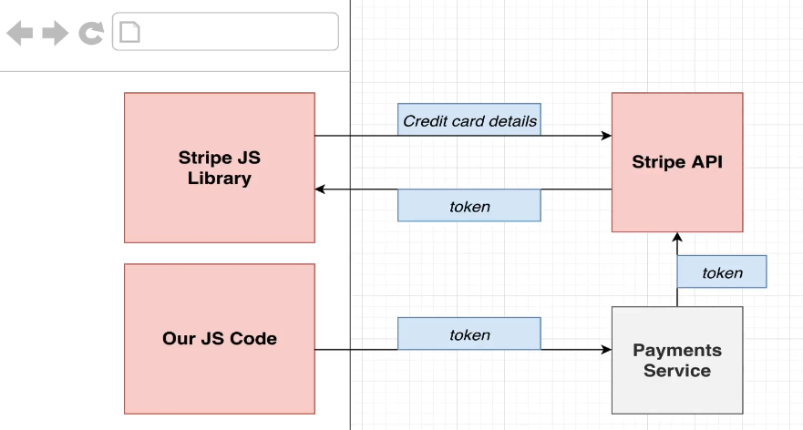

# Client App


Technologies to use: Next.js and React.

## Approaches:

Some information about different approaches considered beforehand:

- Traditional React app using create-react-app: the browser would need to make at least three requests (first for the HTML file → then to fetch the JS files to load and start the React app, and finally another request to fetch service data to render it on the client side).

- Server-side rendering approach: the browser makes a single request to our Next.js development server, which internally fetches all necessary data from our services. Once all the data is gathered, Next.js sends it back to the client — all in one single request. This is much faster, especially for mobile users.

So, we'll go with the server-side rendering approach, as it tends to fit much better for search engine optimization — particularly important for e-commerce apps like this one.

## Useful Information:

To set up routing inside a Next.js project, we need to define a set of routes inside a pages directory. Based on the folder and file names, Next.js interprets these files as distinct routes that users can visit within the app.

Also, we won't be using TypeScript here since this client app will be very basic at the beginning. If we scale in the future, investing time in properly declaring TypeScript for Next JS code might be beneficial. So .. we'll just use JS.

Bootstrap for global css applied in all of our Next JS pages.

Axios for making requests to Auth app.

## First configurations:

- Create docker files (Dockerifle and .dockerignore) for creating the client image.
- To make sure we run this app inside of our k8s cluster, we need to define some deployment file inside of infra/k8s, just like we did for the Auth service.
- Set new rules for skaffold for it to detect changes inside of our client app directory and sync them into our pod running our client image.
- Modify ingress-srv file for accepting requests from the outside and into our Next JS app running inside our cluster (add new path)

## API Calls:

### Creating a user (Sign Up)

Made from `ticketing.dev/auth/signup`

- Target app: `Auth`
- At route: `/api/users/signup/`
- Method: `post`
- Callback: Redirect to the landing page after successfully registering a new user.

### Checking if a User is Logged In (Current User)

Made from `ticketing.dev/`

- Target app: `Auth`
- At route: `ingress-nginx-controller.ingress-nginx.svc.cluster.local/api/users/currentuser`
- Method: `get`
- Callback: Update the page title based on the user's logged-in state.

NOTE: `LandingPage.getInitialProps` function can be executed either while SSR process OR already from the browser, so we can't call axios into just `/api/users/currentuser` path. This is because for those calls made during SSR (from our cluster) we wouldn't have the domain as explicited, so we need to specify it.

- For last case we'd have to reach out to Ingress Nginx for being redirected into the Auth pod. --> Cross namespace communication.

```
http://<NAME_OF_SERVICE>.<NAME_OF_NAMESPACE>.svc.cluster.local/.....
```

- For the case of this call being made from the browser instead, we just need to call the Auth route.

Also, we need to include the session cookie! :B

### Ticket Payment Process



We'll use Stripe JS in our client service to avoid handling any credit card numbers. This library will also create and handle the payment window shown to the user. Once the user has entered all required data for payment, these credit card details will be sent over the Stripe API to eventually receive an auth token (a 'one-time-use-thing' used as a pre-authorization). Once we get the token back in our code, we'll be able to finally charge the user by submitting this token to our payments service.

More specific details about the payment logic at https://github.com/hanoirocker/ticketing_management/blob/main/services/payments/README.md
