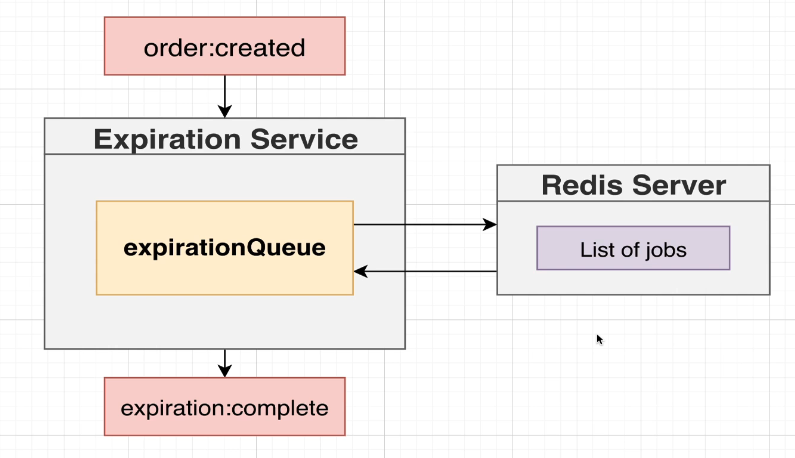
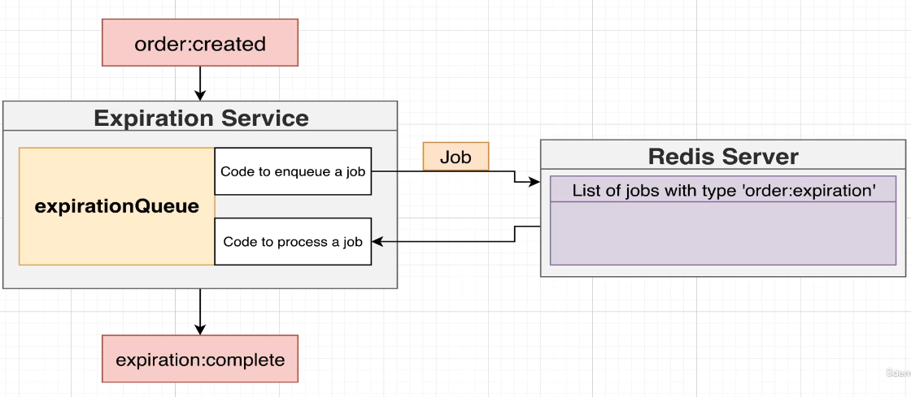
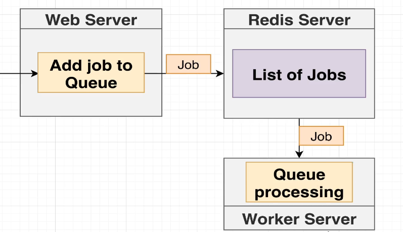

# Expiration

# Timer approaches

- 1. `setTimeout(() => ...., '15min')`: Definitely a possible option, but the big downside to this approach is that this method stores the time variable in memory, so in the future, if by any means the service goes down, these variables will be gone for good `:(`.

- 2. Set up a listener for the `order:created` event and check if the `expiresAt` order property refers to a value in the past. If so, then we trigger an `expiration:complete` event. If not, we would not ack the message. Why? --> By not acking the message, NATS would make sure the order service will trigger the `order:created` event once again after 5 seconds, so we can continue comparing the expiration time based on this procedure. DOWNSIDE: we fully rely on NATS’ redelivery mechanism.

- 3. Implement another event bus (not NATS since this feature is not supported `:(`): Whenever we receive an `order:created` event, we could instantaneously emit an `expiration:complete` event to this second Event BUS but also tell it not to redirect the event to the other services until 15 minutes have passed (scheduled message/event).

- 4. Bull JS (APPROACH TO USE): We could use this library inside the expiration service that would allow us to set long-lived timers. This data would be stored in a Redis server. So, we would receive an `order:created` event, start the countdown, and once that time has passed, we would emit the `expiration:complete` event.

# Some Bull omprehension

As we can see on the following diagrams, bull is expected to created a 'queue' of 'jobs' to be processed, being a 'job' no more than an object with some information stored like its related orderId.

So, when `order:created` is received we'll create the job at `expiration-queue.ts` file to add it as a job into this queue and then Redis Server will be informed about this work for eventually deliver it into the 'Worker Server' to process it.In our case, the process will be a countdown timer.

Bull is able to potentially have multiple Worker servers for processing multiple jobs if needed.

