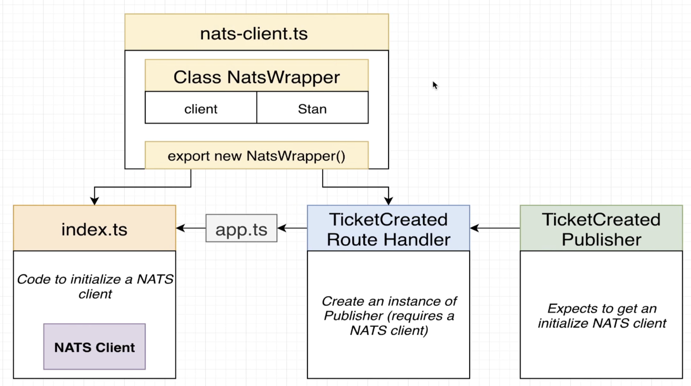
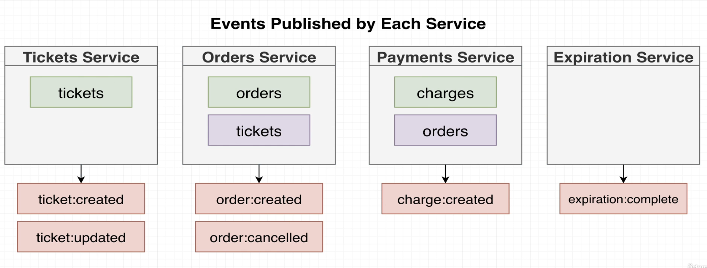

# NATS Streaming Server service (Event Bus)

https://docs.nats.io/

NATS Streaming server is build on top of NATS, which is a very basic implementation for event sharing.
NATS S.S is currently deprecated, but since this whole project doesn’t represent a 100% full example to get straight on prod, we’ll use this service anyways.
Updated alternatives to NATS could be Kafka or RabbitMQ.

## Workflow:

Workflow:

Instead of using Express or Axios at our event bus handler for receiving events and dispatching them to other services, we’ll use a client library specifically designed for working with NATS S.S called `node-nats-streaming` on each of our services.

Note: this library is mostly based on callback’s approach more than async await, etc…

Docs:
https://www.npmjs.com/package/node-nats-streaming

This event flow involves:

- A Publisher: Each service will use the stan client for passing data and subject (name of the channel) into NATS SS.
- A Listener: services that subscribe to specific channels for listening to different types of events, as shown in the following picture:

Listeners will have to specify their own stan instance about which channel to be subscribed.

Also, all events received by our NATS S.S will be stored in memory by default (we could potentially modify this to store export those into files or in a MySQL/Postgres DB if we wanted to). This allow us to keep track of all events communicated between services and if some of those services eventually went down or its own DB was deleted, it could retrieved this events from NATS S.S events storage when up again.

Docker documentation on NATS S.S for command line options:
https://hub.docker.com/_/nats-streaming#:~:text=the%20first%20output.-,Commandline%20Options,-Streaming%20Server%20Options

For any specific extra configuration or command to run inside of our NATS S.S deployment, we’d need to add those inside of `args` list inside of `nats-depl.yaml` at infra folder.

The idea is to run NATS S.S inside of our k8s cluster by deploying it as any other service on our app.

## Notes:

- Event definitions are initially meant to be created here to simplify testing, and then moved to the common library once they are proven to work as expected. Each service will then import event all definitions/structures except for the listeners/publishers since each service may one to process or do different things with data received or before dispatching it.

Since these definitions will be written in TypeScript, this approach can only be leveraged by our microservices or any other service built in JavaScript.
If we wanted a more cross-language approach for these definitions, there are good alternatives available, such as JSON Schema, Protobuf, or Apache Avro.

- Implementing NATSss in our services will require building a single instance (singleton) of the client on a specific file for having access of the client instance from different files of the service using it. This is very similar to what Mongoose does, but we need to build it from scratch this time. So, inside of the nats-wrapper.ts we'll have:
  - NatsWrapper which has the goal of creating and initializing a client for NATSss
  - An export of the previous client instanced for other files to have access to it

## Optimistic Concurrency Control (OCC)

We'll let Mongoose control versioning of tickets/orders DB documents by using the mongoose-update-if-current plugin by applying it directly over ticket and order schemas.
This way we'll make sure each service processes events in the correct and corresponding sequence, avoiding possible concurrency problems between/across services' databases.

- Rule of gold: only services responsible for the OBJECT creation / update / deletion are the ones responsible for updating the versioning property.

## Events published by each service:

- `ticket:created` and `ticket:updated`:

  - Emitted by `tickets` service
  - Listened by `orders` service
  - Reasons:
    - The `orders` service will receive these events and will store a copy of the ticket data inside its own database, and that copy will be related (linked) to an order data structure created when that ticket starts the checkout process.

- `order:created` and `order:cancelled`:

  - Emitted by `orders` service
  - Listened by `tickets` / `payments` / `expiration` services
  - Reasons:
    - The `tickets` service will receive this to ensure the ticket now has an orderId attribute assigned so that the ticket is marked as reserved (checkout process has started). This way the ticket creator can't make any changes to the price or anything else during this reservation period.
    - The `expiration` service will also listen for this event to set a timer based on that orderId, so the ticket doesn't get locked (reserved) forever in case a user can't complete the purchase.
    - The `payments` service listens for `order:created` so to be informed about a possible incomming payment related to a specific orderId, as well as to reject any payment related to that orderId if the order has been cancelled (`order"cancelled`)

- `expiration:complete`

  - Emitted by `expiration` service
  - Listened by `orders` service
  - Reasons:
    - Once the expiration service receives the `order:created` event, it sets a timer for that orderId. Once the time has run out, the `expiration` service needs to trigger this event for other services to decide what to do with the order.

- `charge:created`

  - Emitted by `payment` service
  - Listened by `orders` service
  - Reasons:
    - `orders` service needs to know that an order has been paid for.
