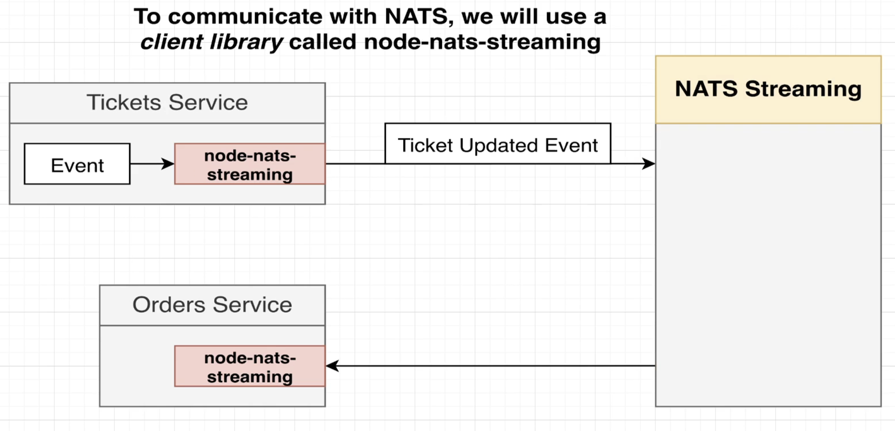
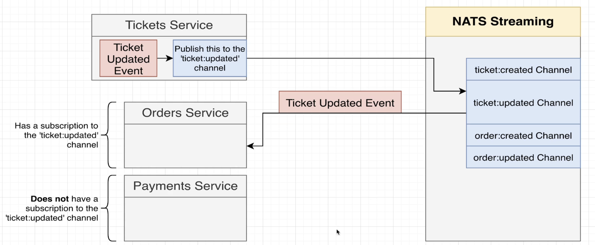

# NATS Streaming Server service (Event Bus)

https://docs.nats.io/

NATS Streaming server is build on top of NATS, which is a very basic implementation for event sharing.
NATS S.S is currently deprecated, but since this whole project doesn’t represent a 100% full example to get straight on prod, we’ll use this service anyways.
Updated alternatives to NATS could be Kafka or RabbitMQ.

## Workflow:

Workflow:

Instead of using Express or Axios at our event bus handler for receiving events and dispatching them to other services, we’ll use a client library specifically designed for working with NATS S.S called `node-nats-streaming` on each of our services.

Note: this library is mostly based on callback’s approach more than async await, etc…

Docs:
https://www.npmjs.com/package/node-nats-streaming

This event flow involves:

- A Publisher: Each service will use the stan client for passing data and subject (name of the channel) into NATS SS.
- A Listener: services that subscribe to specific channels for listening to different types of events, as shown in the following picture:

Listeners will have to specify their own stan instance about which channel to be subscribed.

Also, all events received by our NATS S.S will be stored in memory by default (we could potentially modify this to store export those into files or in a MySQL/Postgres DB if we wanted to). This allow us to keep track of all events communicated between services and if some of those services eventually went down or its own DB was deleted, it could retrieved this events from NATS S.S events storage when up again.

Docker documentation on NATS S.S for command line options:
https://hub.docker.com/_/nats-streaming#:~:text=the%20first%20output.-,Commandline%20Options,-Streaming%20Server%20Options

For any specific extra configuration or command to run inside of our NATS S.S deployment, we’d need to add those inside of `args` list inside of `nats-depl.yaml` at infra folder.

The idea is to run NATS S.S inside of our k8s cluster by deploying it as any other service on our app.

## Notes:

- Event definitions are initially meant to be created here to simplify testing, and then moved to the common library once they are proven to work as expected.

Since these definitions will be written in TypeScript, this approach can only be leveraged by our microservices or any other service built in JavaScript.
If we wanted a more cross-language approach for these definitions, there are good alternatives available, such as JSON Schema, Protobuf, or Apache Avro.
