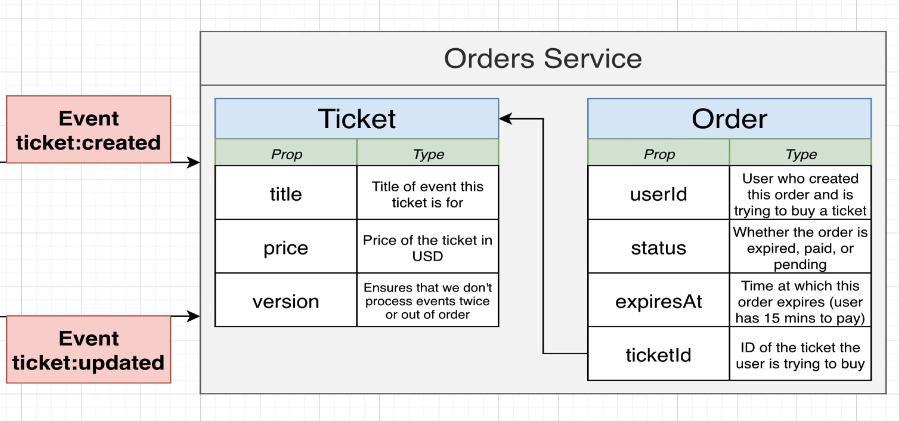
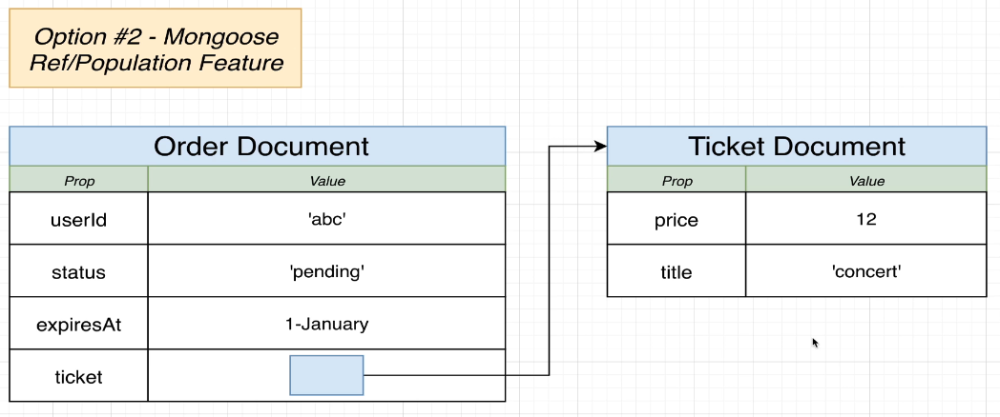

# Orders

This service is meant for managing ticket orders (create, pay or cancel an order). Basic files are copied straight from
the tickets service since they both share a lot of the structure.

## Routes

All routes are meant to be accessed from our frontend application.

## Orders MongoDB

First we need to understand our app goals to be achieved!
Since we'll be receiving events from created, updated or deleted tickets we need to somehow be able to relate each order to create, update or delete to its related ticket.

So for this, we'll have to:

- Store some kind of tickets collection inside our orders database
- Associate the order with its related ticket

### Possible approaches

(Embedding):

Even though embedding the ticket data inside the order document could be the simpler way to relate both concepts, there are two big disadvantages to this approach.

- If a user tries to make an order for a ticket, it would be really challenging to query whether that specific ticket isn't already reserved since we'd have to go through ALL tickets embedded in our orders database to compare their IDs versus the ticket ID to reserve.

- We should definitely have a separate ticket pool for available tickets to be purchased without the need of having to create an order to own that ticket data.

### Possible approaches

(Ref / Population feature):

Collection of documents: orders and tickets. Inside every order we can have a reference to a ticket in our tickets collection or vice versa if needed.

We'll go for this last one `:)` `:check:`
