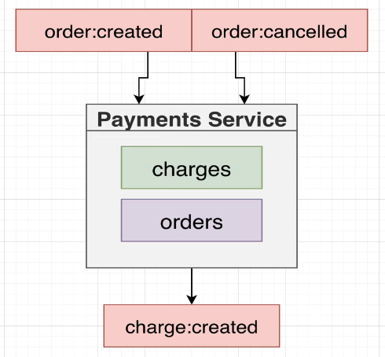
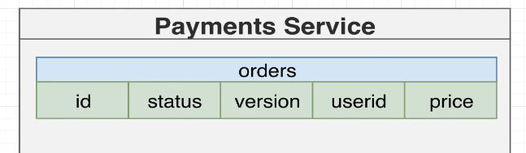
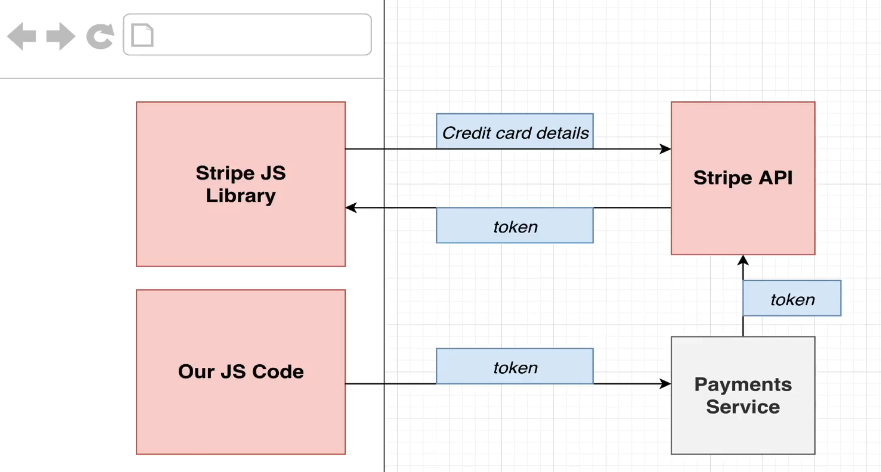
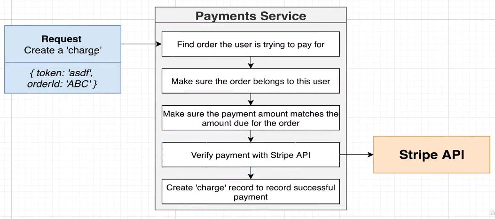

# Payments

This service is meant for handling order's payments process. It needs to understand all the different orders that are created inside of our app, as well as all the changes that are made to those orders over time.
An `order:created` event is going to be emitted every time a user tries to pay for an order, so we need to understand exactly what order they are trying to pay for and also validate that payment ( meaning to validate if the user's the correct user trying to pay for that oder and also the correct amount )

## payments MongoDB

For the previous, we'll have to:

- Replicate data received on both `order:created` and `order:cancelled` into our own orders collection.
- Associate the `chargers` with its related order
- `payments` service will not care about the 'expiresAt' order's property since that property is already handled by the `expiration` service. Not this service's responsability. Neither will recieve the ticket.price property but only its price instead.

## Payments Process

Details about client side at https://github.com/hanoirocker/ticketing_management/blob/main/services/client/README.md

Once we finally receive the payment token we will perfom the following actions:

- On 'Verify payment with Stripe API' we'll use `Node Stripe SDK` to easily communicate with Stripe API providing the `token` and the `API key`. So we'll need to install this dependency and also sign up on Stripe for getting this API key to use on our service.
  IMPORTANT: secrey key provided by Stripe will be stored on a k8s secret's object. For creating this object, we need to run `kubectl create secret generic stripe-secret --from-literal STRIPE_KEY=<SECRET_KEY_HERE>`
  To see all secrets created we can run `kubectl get secrets`

- On 'Create charge record to record successful payment' we'll store this data into our `payments` database
