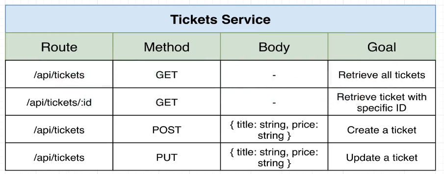
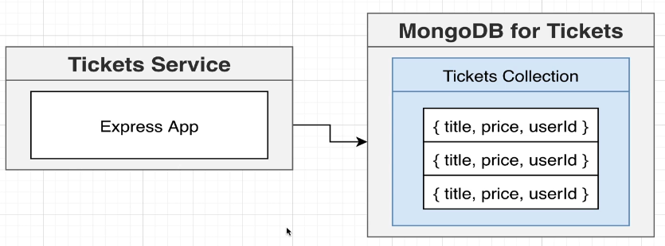

# Tickets

This services is meant for creating / editing tickets. Has all the information about
a ticket such as its title, price and the id of the user who created / modified it.

## Routes:

## Auth MongoDB:

